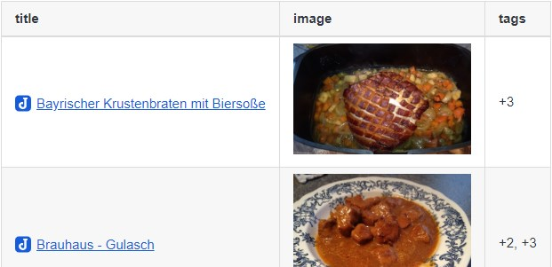

# Joplin note overview

A note overview is created based on the defined search and the specified fields.


<!-- TOC depthfrom:2 orderedlist:false -->

- [Installation](#installation)
    - [Automatic](#automatic)
    - [Manual](#manual)
- [Usage](#usage)
- [Codeblock options](#codeblock-options)
    - [search](#search)
    - [fields](#fields)
    - [sort](#sort)
    - [alias](#alias)
    - [image](#image)
    - [excerpt](#excerpt)
- [Examples](#examples)
    - [ToDo Overview](#todo-overview)
    - [Show all ToDos with status](#show-all-todos-with-status)
    - [Open ToDos for the next 7 days and overdue ToDos](#open-todos-for-the-next-7-days-and-overdue-todos)
    - [Exclude ToDos with no due date](#exclude-todos-with-no-due-date)
    - [Show all ToDos with no due date](#show-all-todos-with-no-due-date)
    - [Rename fields](#rename-fields)
    - [Notes without a tag](#notes-without-a-tag)
    - [Notes createt last 7 days](#notes-createt-last-7-days)
    - [Cooking recipes overview](#cooking-recipes-overview)
- [Plugin options](#plugin-options)
- [Keyboard Shortcuts](#keyboard-shortcuts)
- [FAQ](#faq)
    - [Error: Nested mappings are not allowed in compact mappings](#error-nested-mappings-are-not-allowed-in-compact-mappings)
- [Build](#build)
- [Updating the plugin framework](#updating-the-plugin-framework)
- [Changelog](#changelog)
- [Links](#links)

<!-- /TOC -->

## Installation

### Automatic

- Go to `Tools > Options > Plugins`
- Search for `Note overview`
- Click Install plugin
- Restart Joplin to enable the plugin

### Manual

- Download the latest released JPL package (`io.github.jackgruber.note-overview.jpl`) from [here](https://github.com/JackGruber/joplin-plugin-note-overview/releases/latest)
- Close Joplin
- Copy the downloaded JPL package in your profile `plugins` folder
- Start Joplin

## Usage

Create one or more notes with the following content:

```md
<!-- note-overview-plugin
search: -tag:*
fields: updated_time, title
alias: updated_time AS Last edit, title AS Title
sort: title DESC
-->
```

Several of these blocks can be included in one note, also between text.

The note content is updated every x minutes (depending on your setting) or manualy by `Tools > Create Note overview`.

> ⚠ Adding and editing the code block does not work in the `Rich Text` (WYSIWYG) editor!

## Codeblock options

Options that can be specified in the in the code block using YAML syntax.

### search

The search filter which will be used to create the overview.
[Documentation of search filters](https://joplinapp.org/#search-filters).

```
search: type:todo
```

### fields

Which fields should be output in the table.<br>
All fields of the note are available, a complete list of all field can be found [here](https://joplinapp.org/api/references/rest_api/#properties).

In addition to the Joplin fields, there are the following virtual fields:

- `status`: for todo status
- `file`: List of all attachments
- `file_size`: List of all attachments including their size
- `size`: Size of the note, including attachments
- `tag`: Assigned tags of the note
- `notebook`: Folder in which the note is stored
- `image`: In this field a image resource from the note will be displayed. This field can be configured using the `image` option
- `excerpt`: Displays an excerpt of the note body

```
fields: todo_due, title, tags, notebook
```

### sort

By which field the output should be sorted. It can be only sorted by one field and it's not possible to sort by a virtual field!

```
sort: todo_due ASC
```

### alias

This allows renaming the fields in the output.

Syntax: `<field> AS <new field name>`, multiple fields comma seperated.
```
alias: todo_due AS Due Date, notebook AS Folder
```

### image

This allows you to control the image displayed in the `image` field.

- `nr`: Which image should be displayed
- `exactnr`:
  `false` = If the image number is not found, the last available one is used.
  `true` = Only the exact image number is used.
- `width`: The image is reduced to this width.
- `height`: The image is reduced to this height

```
image:
    nr: 1
    exactnr: true
    width: 200
    height: 200
```

### excerpt

Displays an excerpt of the note body, the length of the excerpt can be configured using `maxlength`.

```
excerpt:
    maxlength: 200
```

## Examples

### ToDo Overview

```
<!-- note-overview-plugin
search: type:todo iscompleted:0
fields: todo_due, title, tags, notebook
sort: todo_due ASC
-->
```

### Show all ToDos with status

```
<!-- note-overview-plugin
search: type:todo
fields: status, todo_due, title
sort: todo_completed ASC
-->
```

### Open ToDos for the next 7 days and overdue ToDos

```
<!-- note-overview-plugin
search: -due:day+7 iscompleted:0
fields: todo_due, title
sort: todo_due ASC
-->
```

### Exclude ToDos with no due date

```
<!-- note-overview-plugin
search: due:19700201 iscompleted:0
fields: todo_due, title
sort: todo_due ASC
-->
```

### Show all ToDos with no due date

```
<!-- note-overview-plugin
search: -due:19700201 iscompleted:0
fields: todo_due, title
sort: todo_due ASC
-->
```

### Rename fields

```
<!-- note-overview-plugin
search: *
fields: updated_time, title
alias: updated_time AS Modified
-->
```

### Notes without a tag

```
<!-- note-overview-plugin
search: -tag:*
fields: updated_time, title
-->
```

### Notes createt last 7 days

```
<!-- note-overview-plugin
search: created:day-7
fields: title, updated_time
sort: title DESC
-->
```

### Cooking recipes overview

```
<!-- note-overview-plugin
search: notebook:Cooking
fields: title, image, tags
image:
  width: 200
  height: 200
-->
```


## Plugin options

Settings for the plugin, accessible at `Tools > Options > Note overview`.

| Option  | Description | Default |
| --- | --- | --- |
| `Show note count` | Show the number of notes found. | `off`| 
| `Update interval in minutes` | How often the overview notes should be updated. | `5` |
| `Field status: open todo` | Text for the `status` field, when the todo is not completed. |  |
| `Field status: todo completed` | Text for the `status` field, when the todo is completed. |  |
| `Field status: todo over due` | Text for the `status` field, when the due date of the todo is exceeded. |  |
| `Color: todo [open]` | HTML color for the `due_date`, when the todo is not completed. |  |
| `Color: todo [open_overdue]` | HTML color for the `due_date`, when the todo is over the due date. | `red` |
| `Color: todo [done]` | HTML color for the `due_date` and `todo_completed`, when the todo is completed. Seperate the color for due_date and todo_completed by a `,`. | `limegreen,limegreen` |
| `Color: todo [done_overdue]` | HTML color for the `due_date` and `todo_completed`, when the todo was completed after the due date. Seperate the color for due_date and todo_completed by a `,`. | `orange,orange` |
| `Color: todo [done_nodue]` | HTML color for the `todo_completed`, when the todo was completed but no due date was set. |  |

## Keyboard Shortcuts

Under `Options > Keyboard Shortcuts` you can assign a keyboard shortcut for the following commands:

- `Create note overview`

## FAQ

### Error: Nested mappings are not allowed in compact mappings

This error message occurs when a colon is used in the option value and an space character follows the colon. Just enclose the value of the option in quotes like `alias: "title AS : Title :"`.

## Build

To build your one version of the plugin, install node.js and run the following command `npm run dist`

## Updating the plugin framework

To update the plugin framework, run `npm run update`

## Changelog

See [Changelog](CHANGELOG.md)

## Links

- [Joplin - Getting started with plugin development](https://joplinapp.org/api/get_started/plugins/)
- [Joplin - Plugin API reference](https://joplinapp.org/api/references/plugin_api/classes/joplin.html)
- [Joplin - Data API reference](https://joplinapp.org/api/references/rest_api/)
- [Joplin - Plugin examples](https://github.com/laurent22/joplin/tree/dev/packages/app-cli/tests/support/plugins)
