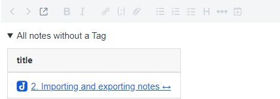
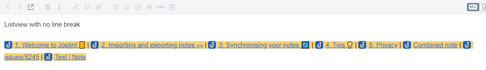

<!-- markdownlint-disable MD033 -->
<!-- markdownlint-disable MD028 -->
<!-- markdownlint-disable MD007 -->

# Joplin note overview

A note overview is created based on the defined search and the specified fields.


<!-- prettier-ignore-start -->

<!-- TOC depthfrom:2 orderedlist:false -->

- [Installation](#installation)
    - [Automatic](#automatic)
    - [Manual](#manual)
- [Usage](#usage)
    - [Limitations](#limitations)
- [Codeblock options](#codeblock-options)
    - [search](#search)
        - [search variable date](#search-variable-date)
    - [fields](#fields)
    - [sort](#sort)
    - [alias](#alias)
    - [datetime](#datetime)
    - [image](#image)
    - [excerpt](#excerpt)
    - [details](#details)
    - [count](#count)
    - [listview](#listview)
    - [link](#link)
    - [status](#status)
- [Examples](#examples)
    - [ToDo Overview](#todo-overview)
    - [Show all ToDos with status](#show-all-todos-with-status)
    - [Open ToDos for the next 7 days and overdue ToDos](#open-todos-for-the-next-7-days-and-overdue-todos)
    - [Exclude ToDos with no due date](#exclude-todos-with-no-due-date)
    - [Show all ToDos with no due date](#show-all-todos-with-no-due-date)
    - [Rename fields](#rename-fields)
    - [Notes without a tag](#notes-without-a-tag)
    - [Notes created last 7 days](#notes-created-last-7-days)
    - [Cooking recipes overview](#cooking-recipes-overview)
    - [Details option](#details-option)
    - [Change count for single overview](#change-count-for-single-overview)
    - [Change to listview no linbreak](#change-to-listview-no-linbreak)
    - [Combine notes dynamically](#combine-notes-dynamically)
    - [Show all uncompleted checkboxes ToDos](#show-all-uncompleted-checkboxes-todos)
    - [Disable automatic note overview update for one note overview](#disable-automatic-note-overview-update-for-one-note-overview)
- [Plugin options](#plugin-options)
- [Keyboard Shortcuts](#keyboard-shortcuts)
- [FAQ](#faq)
    - [The note overview is not updated](#the-note-overview-is-not-updated)
    - [Error: Nested mappings are not allowed in compact mappings](#error-nested-mappings-are-not-allowed-in-compact-mappings)
    - [Error: Implicit map keys need to be followed by map values](#error-implicit-map-keys-need-to-be-followed-by-map-values)
    - [Error: All collection items must start at the same column](#error-all-collection-items-must-start-at-the-same-column)
    - [Error: e.slice is not a function](#error-eslice-is-not-a-function)
- [Develop](#develop)
    - [Build](#build)
    - [Updating the plugin framework](#updating-the-plugin-framework)
- [Changelog](#changelog)
- [Links](#links)

<!-- /TOC -->

<!-- prettier-ignore-end -->

## Installation

### Automatic

- Go to `Tools > Options > Plugins`
- Search for `Note overview`
- Click Install plugin
- Restart Joplin to enable the plugin

### Manual

- Download the latest released JPL package (`io.github.jackgruber.note-overview.jpl`) from [here](https://github.com/JackGruber/joplin-plugin-note-overview/releases/latest)
- Close Joplin
- Copy the downloaded JPL package in your profile `plugins` folder
- Start Joplin

## Usage

Create one or more notes with the following content:

```yml
<!-- note-overview-plugin
search: -tag:*
fields: updated_time, title
alias: updated_time AS Last edit, title AS Title
sort: title DESC
-->
```

Several of these blocks can be included in one note, also between text.

The note content is updated every x minutes (depending on your setting) or manualy by `Tools > Create Note overview`.

### Limitations

> ⚠ Adding and editing the code block does not work in the **Rich Text (WYSIWYG)** editor!

> ⚠ When the note is edited in `Rich Text` (WYSIWYG) editor, the note code block is not preserved!

> ⚠ The manual refresh of the note ist not working in the `Rich Text` (WYSIWYG) editor, to update the note chnage to markdown editor, viewer or a other note and trigger the note overview update again.

> With an automatic update, the currently displayed note opened in the `markdown` or `Rich Text` (WYSIWYG) editor is not updated to prevent data loss during editing!

## Codeblock options

Options that can be specified in the in the code block using YAML syntax.

### search

The search filter which will be used to create the overview.
[Documentation of search filters](https://joplinapp.org/help/apps/search#search-filters).

```yml
search: type:todo
```

#### search variable date

To search for date texts the variable `{{moments:<FORMAT>}}` is available, replace the `<FORMAT>` with the [moments formatting](https://momentjs.com/docs/#/displaying/)

```yml
search: Logbook {{moments:YYYY}}
```

The date can be manipulated with `modify:<MANIPULATION>`, for `<MANIPULATION>` the syntax is `<+ or -><amount><Key>` and the following key. This syntax can be repeated comma separated.

| Modification | Key |
| ------------ | --- |
| years        | y   |
| quarters     | Q   |
| months       | M   |
| weeks        | w   |
| days         | d   |
| hours        | h   |
| minutes      | m   |

```yml
search: Logbook {{moments:DD-MM-YYYY modify:+1m,-1d}}
```

### fields

Which fields should be output in the table.<br>
All fields of the note are available, a complete list of all field can be found [here](https://joplinapp.org/api/references/rest_api/#properties).

In addition to the Joplin fields, there are the following virtual fields:

- `status`: for todo status
- `file`: List of all attachments
- `file_size`: List of all attachments including their size
- `size`: Size of the note, including attachments
- `tags`: Assigned tags of the note
- `notebook`: Folder in which the note is stored
- `breadcrumb`: Folder breadcrumb (Folder path)
- `image`: In this field a image resource from the note will be displayed. This field can be configured using the `image` option
- `excerpt`: Displays an excerpt of the note body
- `link`: Display the `source_url`. This field can be configured using the `link` option

```yml
fields: todo_due, title, tags, notebook
```

### sort

By which field the output should be sorted. It can be only sorted by one field and it's not possible to sort by a virtual field!

```yml
sort: todo_due ASC
```

### limit

Displayes only the first x hits of the search. Without the limit option all results are displayed.

```yml
limit: 5
```

### alias

This allows renaming the fields in the output.

Syntax: `<field> AS <new field name>`, multiple fields comma seperated.

```yml
alias: todo_due AS Due Date, notebook AS Folder
```

### datetime

Customize datetime format for a single overview.

```yml
datetime:
  date: "YYYY-MM-DD"
  time: "HH:mm"
```

- `date`: Set date format. Default is Joplin global settings on `Tools` > `Options` > `General` > `Date format`
- `time`: Set time format. Default is Joplin global settings on `Tools` > `Options` > `General` > `Time format`

Complete list of format can be found [here](https://momentjs.com/docs/#/displaying/format/).

You can also set datetime to [humanize](https://momentjs.com/docs/#/durations/humanize/) format, to display a length of time. You can do that by adding `humanize` settings.

```yml
datetime:
  date: "YYYY-MM-DD"
  time: "HH:mm"
  humanize:
    enabled: [true | false]
    withSuffix: [true | false]
```

- `enabled` : set `true` to enable humanize format. Default is `false`.
- `withSuffix` : set `false`, to remove oriented duration (ex: `a month`). Default is `true`, it will add oriented duration (ex: `in a month`, `a month ago`).

### image

This allows you to control the image displayed in the `image` field.

- `nr`: Which image should be displayed
- `exactnr`:
  `false` = If the image number is not found, the last available one is used.
  `true` = Only the exact image number is used.
- `width`: The image is reduced to this width.
- `height`: The image is reduced to this height

```yml
image:
  nr: 1
  exactnr: true
  width: 200
  height: 200
```

### excerpt

Displays an excerpt of the note body, the length of the excerpt can be configured using `maxlength` or you can use a RegEx to select data for the excerpt.

```yml
excerpt:
  maxlength: 200
  removenewline: [true | false]
  removemd: [true | false]
  regex: ^.*Joplin.*$
  regexflags: gmi
```

- `maxlength`: Maximum length for the excerpt
- `removenewline`: Remove new lines from excerpt, default `true`
- `removemd`: Remove markdown from excerpt, default `true`
- `regex`: Regular expression to match content for the excerpt. `maxlength` will be ignored if this option is used.
- `regexflags`: Regular expression flags for the `regex` match

### details

Add the overview into a details section that can open and close on demand.
In the summary the variable `{{count}}` can be used, to display the number of matched notes.

```yml
details:
  open: [true | false]
  summary: {{count}} notes without a Tag
```

### count

Customize note count field for a single overview.

```yml
count:
  enable: [true | false]
  position: [above | below]
  text: Note count: {{count}}
```

### listview

Option to display the overview as list instead of a table.
For the field `text` all fields can be used, all used Joplin fields must be specified in the `fields`!

```yml
fields: title
listview:
  text: "{{title}} in {{notebook}}"
  linebreak: [true | false]
  separator: " | "
  prefix: ==
  suffix: ==
```

### link

This allows you to control the output displayed in the `link` field.

- `caption`: The text to display for the link (default = `Link`).
- `html`:
  `false` = Output is a markdown link (default)
  `true` = Output is a HTML link

```yml
link:
  caption: "Jump to"
  html: true
```

### status

Customize note status field for a single overview.

```yml
status:
  note: ""
  todo:
    open: ☐
    done: 🗹
    overdue: ⚠
```

## Examples

### ToDo Overview

```yml
<!-- note-overview-plugin
search: type:todo iscompleted:0
fields: todo_due, title, tags, notebook
sort: todo_due ASC
-->
```

### Show all ToDos with status

```yml
<!-- note-overview-plugin
search: type:todo
fields: status, todo_due, title
sort: todo_completed ASC
-->
```

### Open ToDos for the next 7 days and overdue ToDos

```yml
<!-- note-overview-plugin
search: -due:day+7 iscompleted:0
fields: todo_due, title
sort: todo_due ASC
-->
```

### Exclude ToDos with no due date

```yml
<!-- note-overview-plugin
search: due:19700201 iscompleted:0
fields: todo_due, title
sort: todo_due ASC
-->
```

### Show all ToDos with no due date

```yml
<!-- note-overview-plugin
search: -due:19700201 iscompleted:0
fields: todo_due, title
sort: todo_due ASC
-->
```

### Rename fields

```yml
<!-- note-overview-plugin
search: "*"
fields: updated_time, title
alias: updated_time AS Modified
-->

```

### Notes without a tag

```yml
<!-- note-overview-plugin
search: -tag:*
fields: updated_time, title
-->
```

### Notes created last 7 days

```yml
<!-- note-overview-plugin
search: created:day-7
fields: title, updated_time
sort: title DESC
-->
```

### Cooking recipes overview

```yml
<!-- note-overview-plugin
search: notebook:Cooking
fields: title, image, tags
image:
  width: 200
  height: 200
-->
```


### Details option

```yml
<!-- note-overview-plugin
search: -tag:*
fields: title
details:
  open: false
  summary: All notes without a Tag
-->
```



### Change count for single overview

```yml
<!-- note-overview-plugin
search: -tag:*
fields: title
count:
  enable: true
  position: above
  text: For the query {{count}} notes where found
-->

```

### Change to listview (no linbreak)

```yml
<!-- note-overview-plugin
search: -tag:*
fields: title, updated_time
listview:
  text: "{{title}}"
  linebreak: false
  separator: " | "
  prefix: ==
  suffix: ==
-->
```



### Combine notes dynamically

```yml
<!-- note-overview-plugin
search: notebook:"Welcome! (Desktop)"
fields: body
listview:
  text: "{{body}}"
  separator: ---
-->
```

### Show all uncompleted checkboxes (ToDos)

```yml
<!-- note-overview-plugin
search: tag:todo
fields: title, excerpt
listview:
  text: |-

    {{title}}
    {{excerpt}}
excerpt:
  regex: ^.*- \[( )\].*$
  regexflags: gmi
  removenewline: false
  removemd: false
-->
```


### Disable automatic note overview update for one note overview

When you set the `update` option to `manual`, then note overview is only updated when you select the note and trigger a update.

```yml
<!-- note-overview-plugin
search: tag:todo
fields: title, excerpt
update: manual
-->
```

## Plugin options

Settings for the plugin, accessible at `Tools > Options > Note overview`.

## Keyboard Shortcuts

Under `Options > Keyboard Shortcuts` you can assign a keyboard shortcut for the following commands:

- `Create note overview`

## FAQ

### The note overview is not updated

See the [limitations](#limitations) section.

### Error: Nested mappings are not allowed in compact mappings

This error message occurs when a colon is used in the option value and an space character follows the colon. Just enclose the value of the option in quotes like `alias: "title AS : Title :"`.

### Error: Implicit map keys need to be followed by map values

There is a space missing between the `<option>:` and the value. The option should looks like `<option>: <value>`.

### Error: All collection items must start at the same column

If an option value starts with a `{`, the text must be enclosed by quotes.
For example change `text: {{title}} match` to `text: "{{title}} match"`

### Error: e.slice is not a function

If an option value starts with a `{` and and ends with a `}` the text is interpreted as object. Enclose the value with quotes.
For example change `text: {{title}}` to `text: "{{title}}"`

## Develop

### Build

To build your one version of the plugin, install node.js and run the following command `npm run dist`

### Updating the plugin framework

To update the plugin framework, run `npm run update`

## Changelog

See [Changelog](CHANGELOG.md)

## Links

- [Joplin - Getting started with plugin development](https://joplinapp.org/api/get_started/plugins/)
- [Joplin - Plugin API reference](https://joplinapp.org/api/references/plugin_api/classes/joplin.html)
- [Joplin - Data API reference](https://joplinapp.org/api/references/rest_api/)
- [Joplin - Plugin examples](https://github.com/laurent22/joplin/tree/dev/packages/app-cli/tests/support/plugins)
